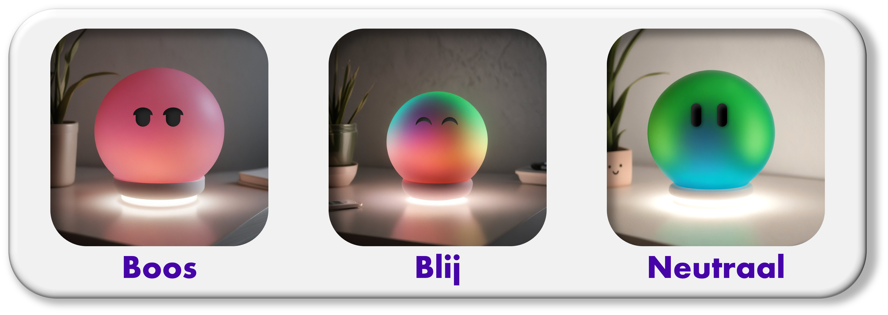

# Wobble
*Reduce stress on parents, by regulating tantrums and emotions from children.* 

Built by ``Rootsaert Selena`` & ``De Bleser Axelle``
Supervised by ``prof. dr. Bas Baccarne``, ``Yannick Christiaens`` & ``Wouter Devriese``    
Grown at ``Ghent University`` - ``Industrial Design Engineering`` ([project overview](https://github.com/basbaccarne/human-centered-design))       

*26/12/2025 since the last update*   

## Summary
### Semester 1
Wobble focuses on the problem of **parental stress in raising children aged 2 to 5**, particularly during times when young children struggle with emotional self-regulation. These situations often lead to escalation, with parents experiencing additional pressure, powerlessness, or guilt.

The problem was investigated through a literature review of stressors in parenting, followed by parent surveys. Based on this, one dominant stressor was selected. In a subsequent phase, brainstorming sessions, observations, and additional literature research were used to gain insight into emotion recognition and regulation in young children and to further substantiate the concept.

The proposed solution, **Wobble**, is a **smart, child-focused product** that supports children in recognizing and regulating their emotions. Instead of correcting the parent or imposing additional tasks, Wobble helps the child calm down independently through gentle, playful stimulation.

By actively supporting the child during stressful moments, the intensity and duration of escalations are reduced. This indirectly reduces stress for the parent and creates a more peaceful environment. Wobble thus positions itself as a supportive link between child and parent.

  
  Figure 1. Wobble Render Semester 1

---

Max 200 words. Describe the project and answer these questions:

- Wat is het probleem?
- Hoe heb je dit onderzocht?
- Wat is jouw oplossing?
- Hoe lost jouw oplossing het probleem op?
- Hero sketch/render/image, vb.

## Introduction

When children have tantrums, it often causes a lot of stress for their parents. Children are usually unaware of the consequences of their behavior, so to help them learn this, we created **Wobble**. Wobble is a virtual pet that expresses emotions very vividly, allowing children to clearly see the impact of their behavior on others. This helps them develop empathy and learn to take responsibility for their own actions.

We want to create a product that fosters a calm home environment. To achieve this, Wobble should guide children in a low-stimulus way, relieving parents of that burden. It must be hands-free and able to recognize cues it should respond to, such as when a child calls out. It’s important that Wobble is easy to clean and safe for children.

With a simple form, light colors, and minimal facial expressions, children will learn the consequences of their behavior and develop a sense of responsibility for their own actions.

---
Max 300 woorden.
Kader je project. Introduceer het probleem en jouw doelstellingen (inclusief boundary conditions).
Maak gebruik van bronverwijzingen ([zie APA stijl](https://www.scribbr.nl/category/apa-stijl/)). Zoals bijvoorbeeld (Thomas & Ritter, 2022) [^1] .

## Content table

1. [Methodology](./docs/methodologie.md)
2. [Discovery](./docs/discovery.md)
3. [Defintion](./docs/definition.md)
4. [Design Requirements](./docs/design_requirements.md)
5. [Bill of materials](./docs/bom.md)

## Critical reflections
We got started very quickly, which gave us enough time for everything. This allowed us to thoroughly go through all the results and conduct additional literature research for the colour test. We are both highly motivated to design Wobble in a thoughtful way, which leads to good collaboration and smooth brainstorming sessions.

So far, Wobble is an idea that teachers and parents in our environment find very interesting. This will motivate us even more to continue developing it in the second semester.

---

Max. 500 woorden

## Note in regards of AI
We translated all the texts with the help of AI.

## Attachments
### Discovery
* Test Analysis and Results, Literatuur **(N=8)** en Enquêtes **(N=21)**
  * [Protocol](https://ugentbe.sharepoint.com/:w:/r/teams/Group.course1292872/_layouts/15/Doc2.aspx?action=edit&sourcedoc=%7Bced13246-a5b9-4a90-ba69-ba7b9f5bedb6%7D&wdOrigin=TEAMS-WEB.teamsSdk_ns.rwc&wdExp=TEAMS-TREATMENT&wdhostclicktime=1766311891243&web=1)
  * [Rapport](https://ugentbe.sharepoint.com/:w:/r/teams/Group.course1292872/_layouts/15/Doc2.aspx?action=edit&sourcedoc=%7B07066592-c11e-4710-9cd2-73e4e3812c40%7D&wdOrigin=TEAMS-WEB.teamsSdk_ns.rwc&wdExp=TEAMS-TREATMENT&wdhostclicktime=1766312112114&web=1)
* Attachments *(Dutch)* 
  * [A. Literatuurstudie - Resultaten Verwerking](https://ugentbe.sharepoint.com/:w:/r/teams/Group.course1292872/_layouts/15/Doc2.aspx?action=edit&sourcedoc=%7Bc34b659c-5ccc-452e-bf36-8e8f0e42ccbd%7D&wdOrigin=TEAMS-WEB.teamsSdk_ns.rwc&wdExp=TEAMS-TREATMENT&wdhostclicktime=1766312562641&web=1)
    * [A.1 The roles of child temperament, parent stress, and parenting style in family mealtimes](https://ugentbe.sharepoint.com/teams/Group.course1292872/Gedeelde%20documenten/General/1.%20Discovery/A.1%20The%20roles%20of%20child%20temperament,%20parent%20stress,%20and%20parenting%20style%20in%20family%20mealtimes.pdf)
    * [A.2 Stress en het opvoeden van een kind - Masterthesis](https://ugentbe.sharepoint.com/teams/Group.course1292872/Gedeelde%20documenten/General/1.%20Discovery/A.2%20Stress%20en%20het%20opvoeden%20van%20een%20kind%20-%20Masterthesis.pdf?CT=1766312664711&OR=ItemsView&wdOrigin=TEAMSFILE.FILEBROWSER.DOCUMENTLIBRARY)
    * [A.3 Mothers’ and fathers’ parenting stress, responsiveness, and child wellbeing among low-income families](https://ugentbe.sharepoint.com/teams/Group.course1292872/Gedeelde%20documenten/General/1.%20Discovery/A.3%20Mothers%E2%80%99%20and%20fathers%E2%80%99%20parenting%20stress,%20responsiveness,%20and%20child%20wellbeing%20among%20low-income%20families.pdf?CT=1766312931391&OR=ItemsView&wdOrigin=TEAMSFILE.FILEBROWSER.DOCUMENTLIBRARY)
    * [A.4 Predictive Factors of Toddlers’ Sleep and Parental Stress](https://ugentbe.sharepoint.com/teams/Group.course1292872/Gedeelde%20documenten/General/1.%20Discovery/A.4%20Predictive%20Factors%20of%20Toddlers%E2%80%99%20Sleep%20and%20Parental%20Stress.pdf?CT=1766312970038&OR=ItemsView&wdOrigin=TEAMSFILE.FILEBROWSER.DOCUMENTLIBRARY)
    * [A.5 Externalizing Behaviors are Associated with Increased Parenting Stress in Caregivers of Young Children with Autism](https://ugentbe.sharepoint.com/teams/Group.course1292872/Gedeelde%20documenten/General/1.%20Discovery/A.5%20Externalizing%20Behaviors%20are%20Associated%20with%20Increased%20Parenting%20Stress%20in%20Caregivers%20of%20Young%20Children%20with%20Autism.pdf?CT=1766313010202&OR=ItemsView&wdOrigin=TEAMSFILE.FILEBROWSER.DOCUMENTLIBRARY)
    * [A.6 Opvoedstress en Extrenaliserend Probleemgedrag - Bachelorthesis](https://ugentbe.sharepoint.com/teams/Group.course1292872/Gedeelde%20documenten/General/1.%20Discovery/A.6%20Opvoedstress%20en%20Extrenaliserend%20Probleemgedrag%20-%20Bachelorthesis.pdf?CT=1766313036011&OR=ItemsView&wdOrigin=TEAMSFILE.FILEBROWSER.DOCUMENTLIBRARY)
    * [A.7 Parent, child, and situational factors associated with parenting stress](https://ugentbe.sharepoint.com/teams/Group.course1292872/Gedeelde%20documenten/General/1.%20Discovery/A.7%20Parent,%20child,%20and%20situational%20factors%20associated%20with%20parenting%20stress.pdf?CT=1766313051706&OR=ItemsView&wdOrigin=TEAMSFILE.FILEBROWSER.DOCUMENTLIBRARY)
    * [A.8 Parenting Stress and Daily Hassles in Mothers of Young and Preschool Children](https://ugentbe.sharepoint.com/teams/Group.course1292872/Gedeelde%20documenten/General/1.%20Discovery/A.8%20Parenting%20Stress%20and%20Daily%20Hassles%20in%20Mothers%20of%20Young%20and%20Preschool%20Children.pdf?CT=1766312880356&OR=ItemsView&wdOrigin=TEAMSFILE.FILEBROWSER.DOCUMENTLIBRARY)
  * [B. Enquêteanalyse - Resultaten Verwerking](https://ugentbe.sharepoint.com/:w:/r/teams/Group.course1292872/_layouts/15/Doc2.aspx?action=edit&sourcedoc=%7B81f10980-9d7f-4b37-b5d9-49a7aa5c6259%7D&wdOrigin=TEAMS-WEB.teamsSdk_ns.rwc&wdExp=TEAMS-TREATMENT&wdhostclicktime=1766312709370&web=1)
  * [B.1 Enquete - Ruwe Resultaten](https://ugentbe.sharepoint.com/:x:/r/teams/Group.course1292872/_layouts/15/Doc2.aspx?action=edit&sourcedoc=%7B44530e08-3bb0-44ab-a6dc-d24771a17a82%7D&wdOrigin=TEAMS-WEB.teamsSdk_ns.rwc&wdExp=TEAMS-TREATMENT&wdhostclicktime=1766312712083&web=1)
  * [B.2 Enquete - Analyse](https://ugentbe.sharepoint.com/:x:/r/teams/Group.course1292872/_layouts/15/Doc2.aspx?action=edit&sourcedoc=%7B9f2f26be-f33a-44e6-b751-ac7fd0bcc098%7D&wdOrigin=TEAMS-WEB.teamsSdk_ns.rwc&wdExp=TEAMS-TREATMENT&wdhostclicktime=1766312713909&web=1)
    
### Definition
* User testing wave 1: Facial expressions (N=29)
  * [Protocol](https://ugentbe.sharepoint.com/:w:/t/Group.course1292872/IQAEfUpEmJ3aSolY1B9GqcFkAYhxIssiV3xpOq-Qz-RI2l0?e=Dg7EdP)
  * [Rapport](https://ugentbe.sharepoint.com/:w:/t/Group.course1292872/IQB7OxXqR-WKT4a1nZOf1vdZAXefGZyn4fxP2Qg6SC7Ef6U?e=4qWh2F)
  * [Analyse](https://ugentbe.sharepoint.com/:x:/t/Group.course1292872/IQCPSVM4RStUQad8WMpz9C6SAfVmIxQdfHyUsfueQz8stwg?e=1j3ITG)
* User testing wave 2: Colourtest (N=29)
  * [Protocol](https://ugentbe.sharepoint.com/:w:/t/Group.course1292872/IQAWP25IfrMtTr9mCONQEjFZAd4VYCpdPxWcOfaT1rh0pcI?e=LgLGrd)
  * [Rapport](https://ugentbe.sharepoint.com/:w:/t/Group.course1292872/IQCiKuJSRuVlRr4PazKVPoMOAYUTUdSXlude2eo4ILDH-JY?e=00H2Qk)
  * [Analyse](https://ugentbe.sharepoint.com/:x:/t/Group.course1292872/IQA-Iia7Az5JRIR0cPlhmmZoAfsf1NpcVpnFugj7QELvu4k?e=HxObNS)
  * [Bijlage1](https://ugentbe.sharepoint.com/:b:/t/Group.course1292872/IQAw31o8ZLQYQ48Tkzs_nRNPAcNEGuAB0mFxEzQBON0vuJs?e=C7HCYa)
  * [Bijlage2](https://ugentbe.sharepoint.com/:b:/t/Group.course1292872/IQDWztdkupDWS7ilgrUHk3JZARC_KnWTdjZEa3PhTTrhjzU?e=QUIlx0)
* User testing wave 3: Interaction Test (N=29)
  * [Protocol](https://ugentbe.sharepoint.com/:w:/t/Group.course1292872/IQC-eSS1aF3UT4GXvDziX7zrAZNLaxY107Z_k1OXsfvJH_0?e=1xxsew)
  * [Rapport](https://ugentbe.sharepoint.com/:w:/t/Group.course1292872/IQDvmaOXufDRTa1D9NTtmylrAUzD0aS8MnVmnhO62K5nugg?e=7ZSCxi)

## License  
This repository contains both software and design materials created as part of an industrial design energineering project at Ghent University.

- **Software and code:** [MIT License](./LICENSE-MIT)  
- **Design, documentation, CAD, and media:** [CC BY 4.0 License](./LICENSE)
  
You cannot reuse and build upon this work, both commercially and non-commercially.

## Bronnen
 [^1]: Thomas, T., & Ritter, A. (2022). Wandering & sundowning in dementia. _Practical Neurology, 21_(3), 36–44.
