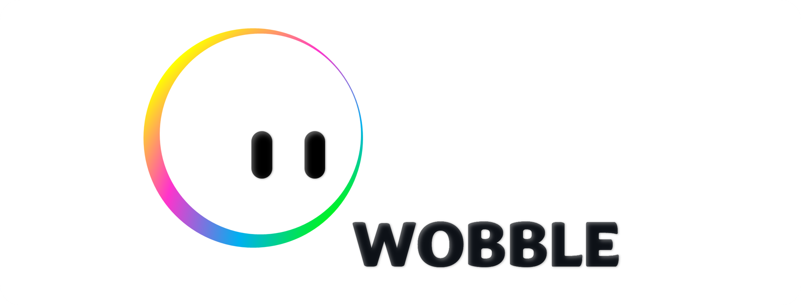
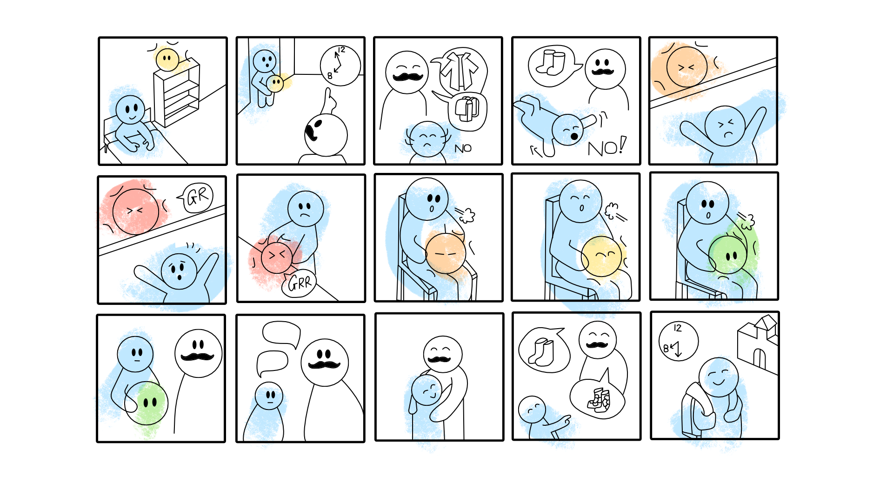

# Wobble
*Reduce stress on parents, by regulating tantrums and emotions from children.* 

  

Built by ``Rootsaert Selena`` & ``De Bleser Axelle``
Supervised by ``prof. dr. Bas Baccarne``, ``Yannick Christiaens`` & ``Wouter Devriese``    
Grown at ``Ghent University`` - ``Industrial Design Engineering`` ([project overview](https://github.com/basbaccarne/human-centered-design))       

*12/04/2026 since the last update*   

## Summary
### Semester 1
Wobble focuses on the problem of **parental stress in raising children aged 2 to 5**, particularly during times when young children struggle with emotional self-regulation. These situations often lead to escalation, with parents experiencing additional pressure, powerlessness, or guilt.

The problem was investigated through a literature review of stressors in parenting, followed by parent surveys. Based on this, one dominant stressor was selected. In a subsequent phase, brainstorming sessions, observations, and additional literature research were used to gain insight into emotion recognition and regulation in young children and to further substantiate the concept.

  
   
  Figure 1. Wobble Render - First Semester

The proposed solution, **Wobble**, is a **smart, child-focused product** that supports children in recognizing and regulating their emotions. Instead of correcting the parent or imposing additional tasks, Wobble helps the child calm down independently through gentle, playful stimulation.

By actively supporting the child during stressful moments, the intensity and duration of escalations are reduced. This indirectly reduces stress for the parent and creates a more peaceful environment. Wobble thus positions itself as a supportive link between child and parent.

### Semester 2
In the second semester, the focus was primarily on the full functionality of the product. This was validated and refined with the help of experts. Subsequently, prototypes were created to further validate the functionality with children and parents.

  
   
  Figure 2. Wobble Render - End Second Semester

This semester, attention was paid not only to the product itself, but also to the experience surrounding it. For instance, tests were conducted focusing on the unboxing of the product to create the best possible first bond with the child.

## Introduction

When children have tantrums, it often causes a lot of stress for their parents. Children are usually unaware of the consequences of their behavior, so to help them learn this, we created **Wobble**. Wobble is a virtual pet that expresses emotions very vividly, allowing children to clearly see the impact of their behavior on others. This helps them develop empathy and learn to take responsibility for their own actions.

  
   
  Figure 3. Storyboard 

We want to create a product that fosters a calm home environment. To achieve this, Wobble should guide children in a low-stimulus way, relieving parents of that burden. It must be hands-free and able to recognize cues it should respond to, such as when a child calls out.

With a simple form, light colors, and minimal facial expressions, children can learn to control their emotions by calming down with Wobble through breathing exercises.

This allows the parents to engage in a conversation about the situation in a quiet and calm manner after the child calmed down.

> **Wobble helps children regulate emotions independently, reducing parental stress during tantrums.**

## Content table

1. [Methodology](./docs/methodologie.md)
2. [Discovery](./docs/discovery.md)
3. [Defintion](./docs/definition.md)
4. [Develop](./docs/develop.md)
5. [Design Requirements](./docs/design_requirements.md)
6. [Bill of materials](./docs/bom.md)

## Critical reflections
### Semester 1
We got started very quickly, which gave us enough time for everything. This allowed us to thoroughly go through all the results and conduct additional literature research for the colour test. We are both highly motivated to design Wobble in a thoughtful way, which leads to good collaboration and smooth brainstorming sessions.

So far, Wobble is an idea that teachers and parents in our environment find very interesting. This will motivate us even more to continue developing it in the second semester.

### Semester 2
It was difficult to create technical prototypes that could validate the entire process. As a result, there were some hesitations between the different phases. Despite the difficult balance between what we wanted to achieve and the technological feasibility, we still managed to focus on a few key aspects with feasible prototypes.

> [!IMPORTANT]
> Note in regards of AI  
> - We translated all the texts with the help of AI.
> - AI was used to further structure the text.

## Attachments
### Discovery
* Test Analysis and Results, Literature **(N=8)** and Survey **(N=21)**
  * [Protocol](https://ugentbe.sharepoint.com/:w:/r/teams/Group.course1292872/_layouts/15/Doc2.aspx?action=edit&sourcedoc=%7Bced13246-a5b9-4a90-ba69-ba7b9f5bedb6%7D&wdOrigin=TEAMS-WEB.teamsSdk_ns.rwc&wdExp=TEAMS-TREATMENT&wdhostclicktime=1766311891243&web=1)
  * [Report](https://ugentbe.sharepoint.com/:w:/r/teams/Group.course1292872/_layouts/15/Doc2.aspx?action=edit&sourcedoc=%7B07066592-c11e-4710-9cd2-73e4e3812c40%7D&wdOrigin=TEAMS-WEB.teamsSdk_ns.rwc&wdExp=TEAMS-TREATMENT&wdhostclicktime=1766312112114&web=1)
* Attachments *(Dutch Analysis)* 
  * [A. Literatuurstudie - Resultaten Verwerking](https://ugentbe.sharepoint.com/:w:/r/teams/Group.course1292872/_layouts/15/Doc2.aspx?action=edit&sourcedoc=%7Bc34b659c-5ccc-452e-bf36-8e8f0e42ccbd%7D&wdOrigin=TEAMS-WEB.teamsSdk_ns.rwc&wdExp=TEAMS-TREATMENT&wdhostclicktime=1766312562641&web=1)
    * [A.1 The roles of child temperament, parent stress, and parenting style in family mealtimes](https://ugentbe.sharepoint.com/teams/Group.course1292872/Gedeelde%20documenten/General/1.%20Discovery/A.1%20The%20roles%20of%20child%20temperament,%20parent%20stress,%20and%20parenting%20style%20in%20family%20mealtimes.pdf)
    * [A.2 Stress en het opvoeden van een kind - Masterthesis](https://ugentbe.sharepoint.com/teams/Group.course1292872/Gedeelde%20documenten/General/1.%20Discovery/A.2%20Stress%20en%20het%20opvoeden%20van%20een%20kind%20-%20Masterthesis.pdf?CT=1766312664711&OR=ItemsView&wdOrigin=TEAMSFILE.FILEBROWSER.DOCUMENTLIBRARY)
    * [A.3 Mothers’ and fathers’ parenting stress, responsiveness, and child wellbeing among low-income families](https://ugentbe.sharepoint.com/teams/Group.course1292872/Gedeelde%20documenten/General/1.%20Discovery/A.3%20Mothers%E2%80%99%20and%20fathers%E2%80%99%20parenting%20stress,%20responsiveness,%20and%20child%20wellbeing%20among%20low-income%20families.pdf?CT=1766312931391&OR=ItemsView&wdOrigin=TEAMSFILE.FILEBROWSER.DOCUMENTLIBRARY)
    * [A.4 Predictive Factors of Toddlers’ Sleep and Parental Stress](https://ugentbe.sharepoint.com/teams/Group.course1292872/Gedeelde%20documenten/General/1.%20Discovery/A.4%20Predictive%20Factors%20of%20Toddlers%E2%80%99%20Sleep%20and%20Parental%20Stress.pdf?CT=1766312970038&OR=ItemsView&wdOrigin=TEAMSFILE.FILEBROWSER.DOCUMENTLIBRARY)
    * [A.5 Externalizing Behaviors are Associated with Increased Parenting Stress in Caregivers of Young Children with Autism](https://ugentbe.sharepoint.com/teams/Group.course1292872/Gedeelde%20documenten/General/1.%20Discovery/A.5%20Externalizing%20Behaviors%20are%20Associated%20with%20Increased%20Parenting%20Stress%20in%20Caregivers%20of%20Young%20Children%20with%20Autism.pdf?CT=1766313010202&OR=ItemsView&wdOrigin=TEAMSFILE.FILEBROWSER.DOCUMENTLIBRARY)
    * [A.6 Opvoedstress en Extrenaliserend Probleemgedrag - Bachelorthesis](https://ugentbe.sharepoint.com/teams/Group.course1292872/Gedeelde%20documenten/General/1.%20Discovery/A.6%20Opvoedstress%20en%20Extrenaliserend%20Probleemgedrag%20-%20Bachelorthesis.pdf?CT=1766313036011&OR=ItemsView&wdOrigin=TEAMSFILE.FILEBROWSER.DOCUMENTLIBRARY)
    * [A.7 Parent, child, and situational factors associated with parenting stress](https://ugentbe.sharepoint.com/teams/Group.course1292872/Gedeelde%20documenten/General/1.%20Discovery/A.7%20Parent,%20child,%20and%20situational%20factors%20associated%20with%20parenting%20stress.pdf?CT=1766313051706&OR=ItemsView&wdOrigin=TEAMSFILE.FILEBROWSER.DOCUMENTLIBRARY)
    * [A.8 Parenting Stress and Daily Hassles in Mothers of Young and Preschool Children](https://ugentbe.sharepoint.com/teams/Group.course1292872/Gedeelde%20documenten/General/1.%20Discovery/A.8%20Parenting%20Stress%20and%20Daily%20Hassles%20in%20Mothers%20of%20Young%20and%20Preschool%20Children.pdf?CT=1766312880356&OR=ItemsView&wdOrigin=TEAMSFILE.FILEBROWSER.DOCUMENTLIBRARY)
  * [B. Enquêteanalyse - Resultaten Verwerking](https://ugentbe.sharepoint.com/:w:/r/teams/Group.course1292872/_layouts/15/Doc2.aspx?action=edit&sourcedoc=%7B81f10980-9d7f-4b37-b5d9-49a7aa5c6259%7D&wdOrigin=TEAMS-WEB.teamsSdk_ns.rwc&wdExp=TEAMS-TREATMENT&wdhostclicktime=1766312709370&web=1)
  * [B.1 Enquete - Ruwe Resultaten](https://ugentbe.sharepoint.com/:x:/r/teams/Group.course1292872/_layouts/15/Doc2.aspx?action=edit&sourcedoc=%7B44530e08-3bb0-44ab-a6dc-d24771a17a82%7D&wdOrigin=TEAMS-WEB.teamsSdk_ns.rwc&wdExp=TEAMS-TREATMENT&wdhostclicktime=1766312712083&web=1)
  * [B.2 Enquete - Analyse](https://ugentbe.sharepoint.com/:x:/r/teams/Group.course1292872/_layouts/15/Doc2.aspx?action=edit&sourcedoc=%7B9f2f26be-f33a-44e6-b751-ac7fd0bcc098%7D&wdOrigin=TEAMS-WEB.teamsSdk_ns.rwc&wdExp=TEAMS-TREATMENT&wdhostclicktime=1766312713909&web=1)
    
### Definition
* User testing wave 1: Colourtest (N=29)
  * [Protocol](https://ugentbe.sharepoint.com/:w:/t/Group.course1292872/IQAWP25IfrMtTr9mCONQEjFZAd4VYCpdPxWcOfaT1rh0pcI?e=LgLGrd)
  * [Report](https://ugentbe.sharepoint.com/:w:/t/Group.course1292872/IQCiKuJSRuVlRr4PazKVPoMOAYUTUdSXlude2eo4ILDH-JY?e=00H2Qk)
    * [Analyse](https://ugentbe.sharepoint.com/:x:/t/Group.course1292872/IQA-Iia7Az5JRIR0cPlhmmZoAfsf1NpcVpnFugj7QELvu4k?e=HxObNS)
    * [Attachment1](https://ugentbe.sharepoint.com/:b:/t/Group.course1292872/IQAw31o8ZLQYQ48Tkzs_nRNPAcNEGuAB0mFxEzQBON0vuJs?e=C7HCYa)
    * [Attachment2](https://ugentbe.sharepoint.com/:b:/t/Group.course1292872/IQDWztdkupDWS7ilgrUHk3JZARC_KnWTdjZEa3PhTTrhjzU?e=QUIlx0)
* User testing wave 2: Facial expressions (N=29)
  * [Protocol](https://ugentbe.sharepoint.com/:w:/t/Group.course1292872/IQAEfUpEmJ3aSolY1B9GqcFkAYhxIssiV3xpOq-Qz-RI2l0?e=Dg7EdP)
  * [Report](https://ugentbe.sharepoint.com/:w:/t/Group.course1292872/IQB7OxXqR-WKT4a1nZOf1vdZAXefGZyn4fxP2Qg6SC7Ef6U?e=4qWh2F)
    * [Analysis](https://ugentbe.sharepoint.com/:x:/t/Group.course1292872/IQCPSVM4RStUQad8WMpz9C6SAfVmIxQdfHyUsfueQz8stwg?e=1j3ITG)
* User testing wave 3: Interaction Test (N=29)
  * [Protocol](https://ugentbe.sharepoint.com/:w:/t/Group.course1292872/IQC-eSS1aF3UT4GXvDziX7zrAZNLaxY107Z_k1OXsfvJH_0?e=1xxsew)
  * [Report](https://ugentbe.sharepoint.com/:w:/t/Group.course1292872/IQDvmaOXufDRTa1D9NTtmylrAUzD0aS8MnVmnhO62K5nugg?e=7ZSCxi)

### Develop
#### Develop 1
* Test Analysis and Results, Interviews **(N=2)**
  * [Protocol](https://ugentbe.sharepoint.com/:w:/r/teams/Group.course1292872/Gedeelde%20documenten/General/3.1%20Develop%201/C.%20Interview_Protocol_De_Bleser_Axelle_Rootsaert_Selena.docx?d=w47ba46f017404340be6610031bfb1eed&csf=1&web=1&e=wnRfKZ)
  * [Report](https://ugentbe.sharepoint.com/:w:/r/teams/Group.course1292872/Gedeelde%20documenten/General/3.1%20Develop%201/C.%20Interview_Rapport_De_Bleser_Axelle_Rootsaert_Selena.docx?d=wb0b0c9f46ac94540b67276597a27215c&csf=1&web=1&e=m44IeN)
* Test Analysis and Results, Literature **(N=13)**
  * [Report](https://ugentbe.sharepoint.com/:w:/r/teams/Group.course1292872/Gedeelde%20documenten/General/3.1%20Develop%201/A.%20Literatuurstudie_De_Bleser_Axelle_Rootsaert_Selena.docx?d=w18a2a41b45c84e6d954b555f8dba34a6&csf=1&web=1&e=cSzSUa)
* Attachments *(Dutch Analysis)*
  * [A.1 Preoperative anxiety management in pediatric patients](https://ugentbe.sharepoint.com/:b:/r/teams/Group.course1292872/Gedeelde%20documenten/General/3.1%20Develop%201/A.1%20Preoperative%20anxiety%20management%20in%20pediatric%20patients%20-%20a%20systemic%20review%20and%20meta-analysis%20of%20randomized%20controlled%20trials%20on%20the%20efficacy%20of%20distraction%20techniques.pdf?csf=1&web=1&e=GMqya8)
  * [A.2 Emotional self-regulation through music in 3-8-year-old children](https://ugentbe.sharepoint.com/:b:/r/teams/Group.course1292872/Gedeelde%20documenten/General/3.1%20Develop%201/A.2%20Emotional%20self-regulation%20through%20music%20in%203-8-year-old%20children.pdf?csf=1&web=1&e=AFuDgZ)
  * [A.3 Therapeutic Group Therapy for Temper Tantrum in Toddler](https://ugentbe.sharepoint.com/:b:/r/teams/Group.course1292872/Gedeelde%20documenten/General/3.1%20Develop%201/A.3%20Therapeutic%20Group%20Therapy%20for%20Temper%20Tantrum%20in%20Toddler.pdf?csf=1&web=1&e=3i2hKv)
  * [A.4 Examining Preschoolers’ Emotion Regulation Strategies](https://ugentbe.sharepoint.com/:b:/r/teams/Group.course1292872/Gedeelde%20documenten/General/3.1%20Develop%201/A.4%20Examining%20Preschoolers%E2%80%99%20Emotion%20Regulation%20Strategies%20-%20Psychometric%20Properties%20of%20the%20Translated%20Dutch%20Early%20Emotion%20Regulation%20Behavior%20Questionnaire%20(EERBQ-Dutch).pdf?csf=1&web=1&e=2RaLf4)
  * [A.5 A calming hug](https://ugentbe.sharepoint.com/:b:/r/teams/Group.course1292872/Gedeelde%20documenten/General/3.1%20Develop%201/A.5%20A%20calming%20hug%20-%20Design%20and%20validation%20of%20a%20tactile%20aid%20to%20ease%20anxiety.pdf?csf=1&web=1&e=PVbAFa)
  * [A.6 The terrible twos](https://ugentbe.sharepoint.com/:b:/r/teams/Group.course1292872/Gedeelde%20documenten/General/3.1%20Develop%201/A.6%20Infancy%20-%202021%20-%20Deichmann%20-%20The%20terrible%20twos%20%20How%20children%20cope%20with%20frustration%20and%20tantrums%20and%20the%20effect%20of%20maternal.pdf?csf=1&web=1&e=tF27ml)
  * [A.7 The role of affective touch](https://ugentbe.sharepoint.com/:b:/r/teams/Group.course1292872/Gedeelde%20documenten/General/3.1%20Develop%201/A.7%20The%20role%20of%20affective%20touch.pdf?csf=1&web=1&e=uBHbAm)
  * [A.8 Softy](https://ugentbe.sharepoint.com/:b:/r/teams/Group.course1292872/Gedeelde%20documenten/General/3.1%20Develop%201/A.8%20Softy.pdf?csf=1&web=1&e=0rGWZ2)
  * [A.9 The use of Multi-Sensory Environments](https://ugentbe.sharepoint.com/:b:/r/teams/Group.course1292872/Gedeelde%20documenten/General/3.1%20Develop%201/A.8%20Softy.pdf?csf=1&web=1&e=0rGWZ2)
  * [A.10 Flat vs. Expressive Storytelling](https://ugentbe.sharepoint.com/:b:/r/teams/Group.course1292872/Gedeelde%20documenten/General/3.1%20Develop%201/A.10%20Flat%20vs.%20Expressive%20Storytelling.pdf?csf=1&web=1&e=ZdC8uR)
  * [A.11 Effectiveness of Sound‐Based Interventions for Improving Functional](https://ugentbe.sharepoint.com/:b:/r/teams/Group.course1292872/Gedeelde%20documenten/General/3.1%20Develop%201/A.11%20Occupational%20Therapy%20International%20-%202025%20-%20Vincent%20-%20Effectiveness%20of%20Sound%E2%80%90Based%20Interventions%20for%20Improving%20Functional.pdf?csf=1&web=1&e=ATvSCr)
  * [A.12 Breezy the Calm Monster](https://ugentbe.sharepoint.com/:b:/r/teams/Group.course1292872/Gedeelde%20documenten/General/3.1%20Develop%201/A.12%20Breezy%20the%20Calm%20Monster.pdf?csf=1&web=1&e=1fTUeF)
  * [A.13 Tranquillity CuBOT](https://ugentbe.sharepoint.com/:b:/r/teams/Group.course1292872/Gedeelde%20documenten/General/3.1%20Develop%201/A.13%20Tranquillity%20CuBOT.pdf?csf=1&web=1&e=ho4pFp)
#### Develop 2
* [Protocol](https://ugentbe.sharepoint.com/:w:/r/teams/Group.course1292872/Gedeelde%20documenten/General/3.2%20Develop%202/A.1%20Protocol_UserTest_Rootsaert_Selena.docx?d=we0e8b6712f9a49db82447199b3e43ae4&csf=1&web=1&e=19OKfX)
* [Report](https://ugentbe.sharepoint.com/:w:/r/teams/Group.course1292872/Gedeelde%20documenten/General/3.2%20Develop%202/C.2%20Rapport_Calming_Test_De_Bleser_Axelle.docx?d=w5b6a43d64d8b4bb0bb88332b30eea574&csf=1&web=1&e=7g91Eh)
  * [Analysis](https://ugentbe.sharepoint.com/:x:/r/teams/Group.course1292872/Gedeelde%20documenten/General/3.2%20Develop%202/C.1%20Data_Calming_Test.xlsx?d=w706c09de432c4d95b8752de7a952309c&csf=1&web=1&e=v34cZC)

## License  
This repository contains both software and design materials created as part of an industrial design energineering project at Ghent University.

- **Software and code:** [MIT License](./LICENSE-MIT)  
- **Design, documentation, CAD, and media:** [CC BY 4.0 License](./LICENSE)
  
You cannot reuse and build upon this work, both commercially and non-commercially.

