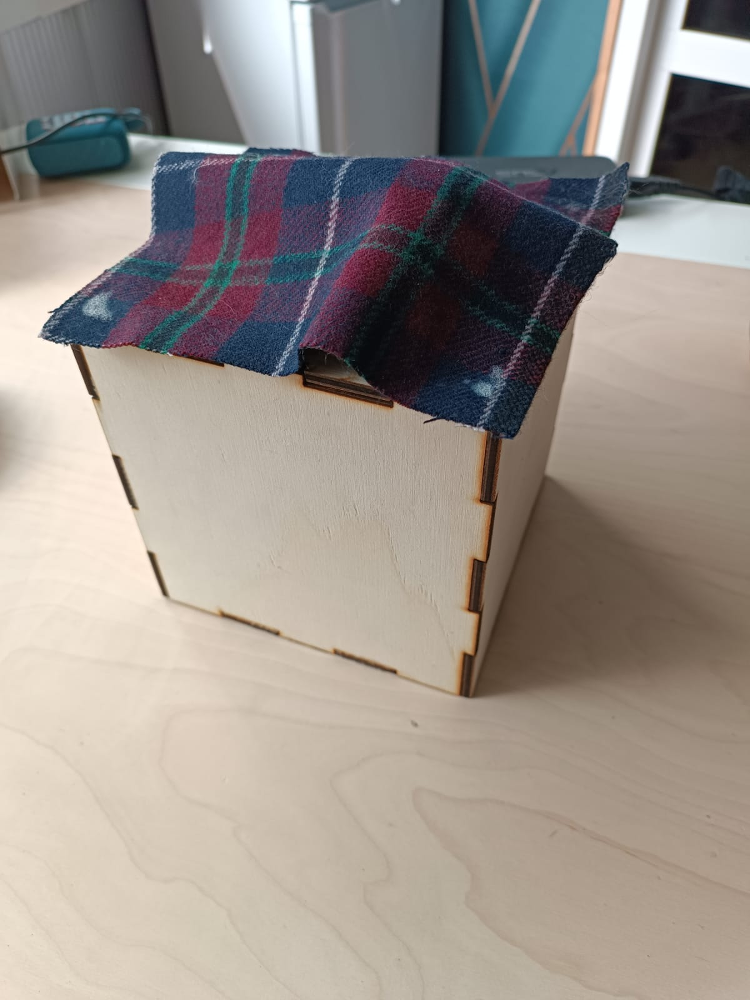
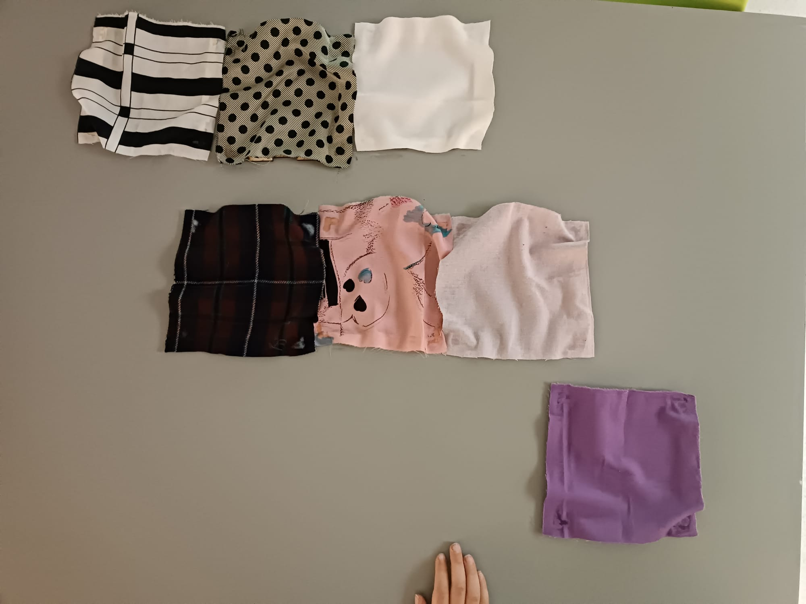
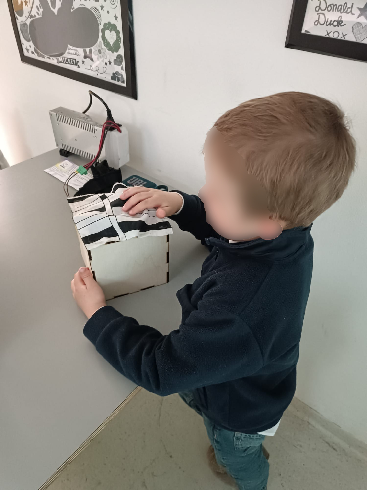
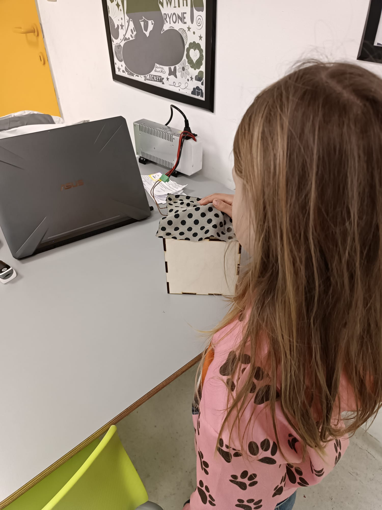

# Develop

## Develop 1 – Expert Interviews (February)
We spraken met verschillende pedagogische experten.

## Develop 2 – Sensory Tests and Material Study (March)
### Doel
Het doel is onderzoeken hoe effectief een ademhalingsbeweging of ademhalingshulp in de vorm van geluid kinderen tussen de 2 en 6 jaar kan helpen om sneller tot rust te komen.

Er wordt een mechanisch ademhalingsritme gerealiseerd en gebruik gemaakt van constante geluiden om de ademhaling te begeleiden.

Daarnaast worden ook verschillende stoffen haptisch getest om af te toetsen hoe aangenaam kleuters deze stoffen vinden. Zo kunnen we nagaan of er een algemene voorkeur is.

### Opbouw prototype
Er werd een modulair prototype gemaakt zodat de verschillende stoffen op eenzelfde prototype geplaatst konden worden.
Er werd een box gelasercut, de bovenste plaat werd verschillende keren gelasercut (1 plaatje per stof).

De box bevatte initieel:
 - Arduino Uno
 - H-bridge L298N
 - 12V battery holder
 - Motor*

**De initiële motor die gebruikt werd was een DC motor, deze was niet zwaar genoeg om de geconnecteerde plaatjes rond te laten draaien. hierna werd een TT motor gebruikt. Deze was ook niet sterk genoeg. Uiteindelijk werd de 12V jgy-370 DC motor gebruikt.* 

Alles behalve de motor werd met kleine bouten en moeren bevestigd aan de houten platen.

  
  
   
  Figure 1. Prototypeimg/Prototpye.jpeg

**Anthropometric Basis for Dimensioning**
The dimensions of the enclosure were derived from anthropometric data obtained from the DINBelg database, which provides measurements for children aged 3 to 6 years (mixed gender) :

> https://www.dinbelg.be/3jaartotaal.htm
> https://www.dinbelg.be/4jaartotaal.htm
> https://www.dinbelg.be/5jaartotaal.htm
> https://www.dinbelg.be/6jaartotaal.htm

**Hand Length (mm)**
| Age     | P1  | P5  | Mean | P95 | P99 | SD  |
| ------- | --- | --- | ---- | --- | --- | --- |
| 3 years | 93  | 97  | 107  | 117 | 121 | 6.8 |
| 4 years | 99  | 104 | 115  | 126 | 131 | 7.3 |
| 5 years | 104 | 109 | 122  | 135 | 140 | 7.8 |
| 6 years | 110 | 115 | 128  | 141 | 146 | 7.9 |

**Hand Width (mm)**
| Age     | P1 | P5 | Mean | P95 | P99 | SD  |
| ------- | -- | -- | ---- | --- | --- | --- |
| 3 years | 41 | 43 | 47   | 52  | 54  | 3.5 |
| 4 years | 44 | 46 | 52   | 58  | 61  | 3.9 |
| 5 years | 47 | 50 | 57   | 64  | 67  | 4.3 |
| 6 years | 51 | 54 | 60   | 66  | 69  | 3.8 |

The prototype was primarily intended for third-year kindergarten children (ages 5–6). Therefore, the design was based on the mean hand dimensions of this age group.
Using these values, the enclosure was designed as a square with an internal side length of 125 mm (12.5 cm). This dimension provides a balance between ergonomic handling for the target age group and sufficient internal volume to accommodate the required electronic components.

**Motion Mechanism**
Om de beweging te verkrijgen werden halve cirkels gelasercut. Deze vorm kon zowel boven de doos uitsteken en de stof naar boven duwen, als onder de stof blijven zodat de hand van de testpersoon omlaag gaat.

  
   
  Figure 2. Plaatjes adembeweging

### Testverloop
1. Het kind werd geblinddoekt naar een tafel gebracht waar hij of zij 1 voor 1 de verschillende stoffen mocht aanvoelen. (geblinddoekt zodat het kleur of patroon geen invloed had) Er werd steeds gevraagd of de stof leuker of minder leuk aanvoelde dan de vorige, zo kon de precieze plek van een stof bepaald worden. 

  
   
  Figure 3. minst aangename (linksboven) naar aangenaamste (rechtsonder)

2. De favoriet werd op het prototype geplaatst. De hartslag werd afgenomen en genoteerd. Het kind mocht al eens voelen aan het prototype zodat ze weten dat er iets zal bewegen.

3. Het kind legde een kort loopparkoer af. Dit werd getimed om het competitiever te maken voor het kind.

4. Na het lopen werd de hartslag meteen gemeten en genoteerd. Vanaf nu gebeurt dit om de 2 minuten.

5. Het kind gaat naar het prototype en legt zijn of haar hand op de bovenkant.

  
  
   
  Figure 4. Testen van het ademhalingsmechanisme

Deze volgorde wordt bij ieder kind gedaan. Nadat ieder kind geweest mogen ze in dezelfde volgorde 1 voor 1 terugkomen en start de volgende fase.

6. De hartslag wordt als extra rustreferentie gemeten, daarna wordt de looptest opnieuw getimed uitgevoerd.

7. Het kind zit op een stoel en luistert naar de audio. Opnieuw wordt om de twee minuten de hartslag gemeten en genoteerd.

Er wordt bij iedere fase op het einde gevraagd of ze weten waarom ik ze dit laat doen. Ze weten niet waarom het prototype of de audio dient. Wanneer vermeld wordt dat het de bedoeling is dat ze mee ademen met de beweging of het geluid om rustig te worden proberen enkele kindjes dit te doen zonder ik het ze expliciet vraag.

### Conclusion
> [!Note]
> The full details of the test analysis and results can be found in the report.
> [C.2 Rapport_Calming_Test_De_Bleser_Axelle](https://ugentbe.sharepoint.com/:w:/t/Group.course1292872/IQDWQ2pbi02wS7uIMysw7qV0AVG_IiHluOfWckKgq9gauwY?e=6I5F7z)

De test waarbij gebruik gemaakt werd van de ademhalingsbeweging werd het beste ervaren door de kinderen. Ook tijdens de observatie werd opgemerkt dat de kinderen veel beter hun focus konden houden wanneer ze haptisch op iets konden focussen.

Het mee ademhalen met het ritme was algemeen moeilijk, er was nog niet genoeg rekening gehouden met het feit dat kinderen algemeen (en dus ook in rust) sneller ademen dan volwassenen.

> [!IMPORTANT]
> An overview of the product requirements can be found under [Design Requirements](./design_requirements.md).
