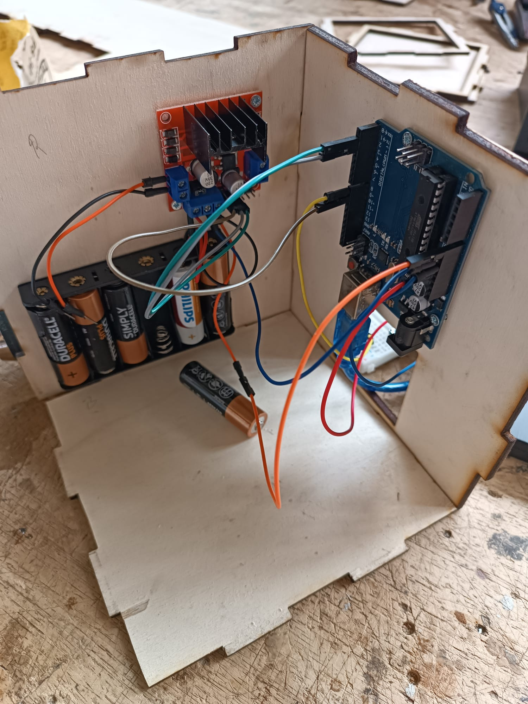
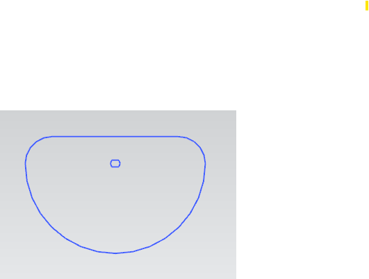

# Develop

## Expert Interviews (February)
We spraken met verschillende pedagogische experten.

## Sensory Tests and Material Study (March)

### Opbouw prototype
Er werd een modulair prototype gemaakt zodat de verschillende stoffen op eenzelfde prototype geplaatst konden worden.
Er werd een box gelasercut, de bovenste plaat werd verschillende keren gelasercut (1 plaatje per stof).

De box bevatte initieel:
 - Arduino Uno
 - H-bridge L298N
 - 12V battery holder
 - Motor*

**De initiële motor die gebruikt werd was een DC motor, deze was niet zwaar genoeg om de geconnecteerde plaatjes rond te laten draaien. hierna werd een TT motor gebruikt. Deze was ook niet sterk genoeg. Uiteindelijk werd de 12V jgy-370 DC motor gebruikt.* 

Alles behalve de motor werd met kleine bouten en moeren bevestigd aan de houten platen.

  
   
  Figure 2. Plaatjes adembeweging

Om de beweging te verkrijgen werden niet volledige cirkels gelasercut. Deze vorm kon zowel boven de doos uitsteken en de stof naar boven duwen, als onder de stof blijven zodat de hand van de testpersoon omlaag gaat.

  
   
  Figure 2. Plaatjes adembeweging

