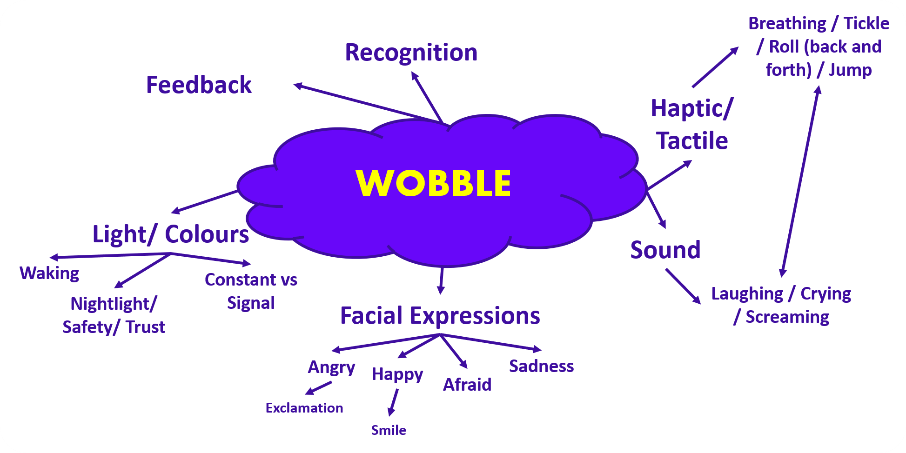

# Develop

    
     
    Figure 1. Develop Overview (placeholder Develop 1 & 2)

## Develop 1 – Expert Interviews and Concept Focusing (February)
### Goal
At the start of the second semester, a broad exploration of the Wobble concept was conducted to assess its full scope and complexity. This began with the creation of a **comprehensive mind map**, in which all possible components, interaction types, and functionalities of Wobble were mapped out. The mind map revealed that the concept, in its current form, was overly extensive and **lacked prioritization**. Multiple interaction modalities (e.g. light, sound, movement, touch) and behavioural features were considered simultaneously, making it difficult to determine which elements were essential for achieving the core goal.

  
   
  Figure 2. Initial mind map of Wobble functionalities and interaction modalities

### Literature Study and Technology Analysis
To reduce this complexity, a **literature study** was conducted, focusing on the role of different technologies and interaction types in child development and emotional regulation. Each source was first individually assessed in terms of relevance and reliability. Subsequently, the findings were systematically regrouped and analyzed across five categories :
-	Tactile 
-	Auditory 
-	Visual 
-	Movement-based 
-	Cognitive 

Within each category, recurring mechanisms and interaction types were identified and compared. This resulted in an overview of which sensory modalities are most frequently associated with calming, engagement, and emotional recognition in young children.

  Tabel 2. Overview of technology types and interaction mechanisms derived from literature (middle row) and expert insights (bottom row)

| Tactile | Auditory | Visual | Movement | Cognitive |
|--------|----------|---------|----------|-----------|
| - Physical comfort (2x) - Hugging contact - Breathing co-regulation - Gentle stroking (hugging, caressing) - Gentle pressure - Self-soothing - Sensory space | - Music (general) - Favorite music - Calm music - Sleep music - Rhythmic music (2x) - Rhythmic sounds - Sound as trigger - Breathing rhythm audio - Soft auditory feedback | - Cartoons - VR - Visual distraction - Light projections - Expressive faces - Breathing rhythm light visualization - Soft light transitions | - Rhythmic breath expansion (2x) - Physical venting - Movement combined with sensory input | - Emotional education - Increase caregiver responsiveness - Group reflection - Guided breathing - Muscle relaxation - Breath focus (indirect via movement) - Guided visualization - Music as an imaginative framework - Distraction - Pretend play (2x) - Self-selected music - Self-awareness - Seeking verbal help - Narrative expression |
| - Soft presence - Hugging - Weighted blankets - Caressing - Snoezelen rooms | - Sound as trigger - Music - Breathing rhythm audio | - Color as a calming indicator - Expressive faces | - Breath expansion | - Structure - Predictability |

From this analysis, a clear pattern emerged : effective emotional regulation is **rarely achieved through a single modality**, but rather through a **combination of complementary sensory inputs**. The literature consistently pointed toward a configuration in which multiple regulatory mechanisms reinforce each other.
The most promising combination identified was :
-	Tactile feedback (e.g. soft touch, hugging, pressure),
-	Rhythmic breathing guidance (e.g. expansion/contraction, movement),
-	Soft auditory support (e.g. breathing sounds, calm audio cues).

These correspond to three underlying regulation mechanisms :
-	Tactile safety : creating a sense of comfort and security through physical contact,
-	Physiological synchronization : guiding the child’s breathing rhythm to induce calmness,
-	Auditory calming : reinforcing relaxation through predictable and soft sound cues.

This triad formed the initial foundation for further concept development.

### Expert Interviews
To validate and contextualize these findings, *expert interviews* were conducted on March 2 and March 5 with :
-	Liezl Mullebrouck 
-	Hanne Corne 

The interviews focused on emotional development in early childhood, appropriate forms of sensory stimulation, and how children interact with non-living objects that display emotional cues.
Both experts emphasized the importance of :
-	Subtle guidance rather than explicit instruction,
-	Physical interaction (touch, proximity) as a primary form of comfort,
-	Predictability and structure in calming interventions,
-	Avoiding overstimulation through excessive visual or auditory input.

These insights aligned strongly with the literature findings, particularly regarding the importance of tactile and rhythmic elements. Additionally, the experts highlighted that children in this age group often respond more intuitively to **physical and sensory cues** than to abstract or cognitive interventions.

### Synthesis and Prioritization
The findings from the literature study and expert interviews were combined into a structured prioritization using a **MoSCoW matrix** (see Figure 3). This matrix was used to define which features should be central in the next phase of development and which should be deprioritized.

  
   
  Figure 3. MoSCoW prioritization of Wobble functionalities 
 

### Outcome
This phase resulted in a **clear narrowing of the concept scope**. Rather than developing a multi-functional or highly interactive system, Wobble is further defined as a calm, supportive, and sensory-driven object that operates through subtle cues.
The core interaction principle emerging from Develop 1 can be summarized as :

> **Guiding the child toward calmness through combined tactile, rhythmic, and auditory feedback, without requiring explicit attention or instruction.**

This prioritization formed the basis for Develop 2, in which these key interaction principles were translated into tangible prototypes and experimentally tested.

> [!Note]
> The full details of the tests and results can be found in the Design Report.
> [D3. Develop_1_Report_De_Bleser_Axelle_Rootsaert_Selena](https://ugentbe.sharepoint.com/:w:/r/teams/Group.course1292872/Gedeelde%20documenten/General/3.1%20Develop%201/C.%20Interview_Rapport_De_Bleser_Axelle_Rootsaert_Selena.docx?d=wb0b0c9f46ac94540b67276597a27215c&csf=1&web=1&e=4CA7Jq)

> [!IMPORTANT]
> An overview of the product requirements can be found under [Design Requirements](./design_requirements.md).

## Develop 2 – Sensory Tests and Material Study (March - April)
### Goal
The aim is to investigate how effectively a breathing movement or breathing aid in the form of sound can help children aged 2 to 6 to calm down more quickly.
 
A mechanical breathing rhythm is established, and constant sounds are used to guide the breathing.
 
Additionally, various substances are haptically tested to determine how pleasant preschoolers find these substances. This allows us to ascertain whether there is a general preference.

> [!Note]
> The full approach to the tests and interviews can be found in the Design Protocol.
> [D3. Develop_2_Protocol_Rootsaert_Selena](https://ugentbe.sharepoint.com/:w:/r/teams/Group.course1292872/Gedeelde%20documenten/General/3.2%20Develop%202/A.1%20Protocol_UserTest_Rootsaert_Selena.docx?d=we0e8b6712f9a49db82447199b3e43ae4&csf=1&web=1&e=Ug6uzM)

### Prototype assembly
A modular prototype was made so that the different fabrics could be placed on the same prototype.

**Anthropometric Basis for Dimensioning**

The dimensions of the enclosure were derived from anthropometric data obtained from the DINBelg database, which provides measurements for children aged 3 to 6 years (mixed gender) :

> https://www.dinbelg.be/3jaartotaal.htm
> 
> https://www.dinbelg.be/4jaartotaal.htm
> 
> https://www.dinbelg.be/5jaartotaal.htm
> 
> https://www.dinbelg.be/6jaartotaal.htm

**Hand Length (mm)**
| Age     | P1  | P5  | Mean | P95 | P99 | SD  |
| ------- | --- | --- | ---- | --- | --- | --- |
| 3 years | 93  | 97  | 107  | 117 | 121 | 6.8 |
| 4 years | 99  | 104 | 115  | 126 | 131 | 7.3 |
| 5 years | 104 | 109 | 122  | 135 | 140 | 7.8 |
| 6 years | 110 | 115 | 128  | 141 | 146 | 7.9 |

**Hand Width (mm)**
| Age     | P1 | P5 | Mean | P95 | P99 | SD  |
| ------- | -- | -- | ---- | --- | --- | --- |
| 3 years | 41 | 43 | 47   | 52  | 54  | 3.5 |
| 4 years | 44 | 46 | 52   | 58  | 61  | 3.9 |
| 5 years | 47 | 50 | 57   | 64  | 67  | 4.3 |
| 6 years | 51 | 54 | 60   | 66  | 69  | 3.8 |

The prototype was primarily intended for third-year kindergarten children (ages 5–6). Therefore, the design was based on the mean hand dimensions of this age group.
Using these values, the enclosure was designed as a square with an internal side length of 125 mm (12.5 cm). This dimension provides a balance between ergonomic handling for the target age group and sufficient internal volume to accommodate the required electronic components.

**Motion Mechanism**

To achieve the movement, semicircles were laser-cut. This shape could either protrude above the box and push the fabric upwards, or remain below the fabric so that the test subject's hand moves downwards.

  
   
  Figure 5. Drawing - Plates for breathing movement

A box was laser-cut; the top plate was laser-cut several times (1 plate per fabric).
 
The box initially contained:
- Arduino Uno
- H-bridge L298N
- 12V battery holder
- Motor*
 
**The initial motor used was a DC motor; it was not powerful enough to rotate the connected plates. Next, a TT motor was used. This was also not strong enough. Finally, the 12V JGY-370 DC motor was used.*
 
Everything except the motor was attached to the wooden plates with small bolts and nuts.

  
  
   
  Figure 4. Prototype

### Test procedure
1. The child was blindfolded and led to a table where he or she was allowed to feel the different fabrics one by one. (blindfolded so that the color or pattern had no influence) After each use, they were asked if the fabric felt nicer or less nice than the previous one, so that the precise placement of a fabric could be determined. 

  
   
  Figure 6. Fabrics - Least pleasant (upper left) to most pleasant (bottom right)

2. The favorite was placed on the prototype. The heart rate was measured and recorded. The child was allowed to touch the prototype so that they know something will move.
 
3. The child completed a short running course. This was timed to make it more competitive for the child.
 
4. After running, the heart rate was immediately measured and recorded. From now on, this will be done every 2 minutes.
 
5. The child goes to the prototype and places his or her hand on the top.

  
  
   
  Figure 7. Testing the breathing mechanism

This sequence is followed for every child. After every child has had their turn, they may return one by one in the same order, and the next phase begins.
 
6. The heart rate is measured as an additional resting reference; subsequently, the walking test is timed and performed again.
 
7. The child sits on a chair and listens to the audio. Again, the heart rate is measured and recorded every two minutes.
 
At the end of each phase, they are asked if they know why I am having them do this. They do not know the purpose of the prototype or the audio. When it is mentioned that the intention is for them to breathe along with the movement or sound to calm down, a few children try to do this without me explicitly asking them.

### Conclusion
The test utilizing breathing movements was perceived best by the children. During the observation, it was also noted that the children were much better able to maintain their focus when they could focus haptically on something.
 
Breathing along with the rhythm was generally difficult; insufficient account had been taken of the fact that children generally breathe faster than adults (and therefore also at rest).

> [!Note]
> The full details of the test analysis and results can be found in the report.
> [D3. Develop_2_Report_De_Bleser_Axelle](https://ugentbe.sharepoint.com/:w:/t/Group.course1292872/IQDWQ2pbi02wS7uIMysw7qV0AVG_IiHluOfWckKgq9gauwY?e=6I5F7z)

> [!IMPORTANT]
> An overview of the product requirements can be found under [Design Requirements](./design_requirements.md).

## Develop 3 - Allround Tests and Interaction Design (May)

