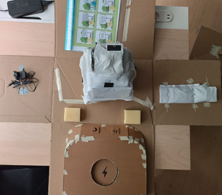
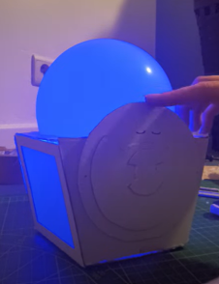
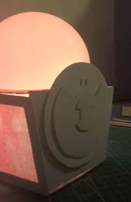

# Develop

    
     
    Figure 1. Develop Overview (placeholder Develop 1 & 2)

## Develop 1 – Expert Interviews and Concept Focusing (February)
### Goal
At the start of the second semester, a broad exploration of the Wobble concept was conducted to assess its full scope and complexity. This began with the creation of a **comprehensive mind map**, in which all possible components, interaction types, and functionalities of Wobble were mapped out.

The mind map revealed that the concept had become overly broad and lacked a clear prioritization of functionalities. Multiple interaction modalities (e.g. light, sound, movement, and touch) and behavioural features were considered simultaneously, making it difficult to determine which elements were essential for achieving the core objective of the project.

  
   
  Figure 2. Initial mind map of Wobble functionalities and interaction modalities

### Literature Study and Technology Analysis
To reduce this complexity, a **literature study** was conducted, focusing on the role of different technologies and interaction types in child development and emotional regulation. Each source was first individually assessed in terms of relevance and reliability. Subsequently, the findings were systematically regrouped and analyzed across five categories :
-	Tactile 
-	Auditory 
-	Visual 
-	Movement-based 
-	Cognitive 

Within each category, recurring mechanisms and interaction types were identified and compared. This resulted in an overview of which sensory modalities are most frequently associated with calming, engagement, and emotional recognition in young children.

  Tabel 2. Overview of technology types and interaction mechanisms derived from literature (middle row) and expert insights (bottom row)

| Tactile | Auditory | Visual | Movement | Cognitive |
|--------|----------|---------|----------|-----------|
| - Physical comfort (2x) - Hugging contact - Breathing co-regulation - Gentle stroking (hugging, caressing) - Gentle pressure - Self-soothing - Sensory space | - Music (general) - Favorite music - Calm music - Sleep music - Rhythmic music (2x) - Rhythmic sounds - Sound as trigger - Breathing rhythm audio - Soft auditory feedback | - Cartoons - VR - Visual distraction - Light projections - Expressive faces - Breathing rhythm light visualization - Soft light transitions | - Rhythmic breath expansion (2x) - Physical venting - Movement combined with sensory input | - Emotional education - Increase caregiver responsiveness - Group reflection - Guided breathing - Muscle relaxation - Breath focus (indirect via movement) - Guided visualization - Music as an imaginative framework - Distraction - Pretend play (2x) - Self-selected music - Self-awareness - Seeking verbal help - Narrative expression |
| - Soft presence - Hugging - Weighted blankets - Caressing - Snoezelen rooms | - Sound as trigger - Music - Breathing rhythm audio | - Color as a calming indicator - Expressive faces | - Breath expansion | - Structure - Predictability |

From this analysis, a clear pattern emerged : effective emotional regulation is **rarely achieved through a single modality**, but rather through a **combination of complementary sensory inputs**. The literature consistently pointed toward a configuration in which multiple regulatory mechanisms reinforce each other.
The most promising combination identified was :
-	Tactile feedback (e.g. soft touch, hugging, pressure),
-	Rhythmic breathing guidance (e.g. expansion/contraction, movement),
-	Soft auditory support (e.g. breathing sounds, calm audio cues).

These correspond to three underlying regulation mechanisms :
-	**Tactile safety** : creating a sense of comfort and security through physical contact,
-	**Physiological synchronization** : guiding the child’s breathing rhythm to induce calmness,
-	**Auditory calming** : reinforcing relaxation through predictable and soft sound cues.

This triad formed the initial foundation for further concept development.

### Expert Interviews
To validate and contextualize these findings, *expert interviews* were conducted on March 2 and March 5 with :
-	Liezl Mullebrouck 
-	Hanne Corne 

The interviews focused on emotional development in early childhood, appropriate forms of sensory stimulation, and how children interact with non-living objects that display emotional cues.
Both experts emphasized the importance of :
-	Subtle guidance rather than explicit instruction,
-	Physical interaction (touch, proximity) as a primary form of comfort,
-	Predictability and structure in calming interventions,
-	Avoiding overstimulation through excessive visual or auditory input.

These insights aligned strongly with the literature findings, particularly regarding the importance of tactile and rhythmic elements. Additionally, the experts highlighted that children in this age group often respond more intuitively to **physical and sensory cues** than to abstract or cognitive interventions.

### Synthesis and Prioritization
The findings from the literature study and expert interviews were combined into a structured prioritization using a **MoSCoW matrix** (see Figure 3). This matrix was used to define which features should be central in the next phase of development and which should be deprioritized.

  
   
  Figure 3. MoSCoW prioritization of Wobble functionalities 
 

### Outcome
This phase resulted in a **clear narrowing of the concept scope**. Rather than developing a multi-functional or highly interactive system, Wobble is further defined as a calm, supportive, and sensory-driven object that operates through subtle cues.
The core interaction principle emerging from Develop 1 can be summarized as :

> **Guiding the child toward calmness through combined tactile, rhythmic, and auditory feedback, without requiring explicit attention or instruction.**

This prioritization formed the basis for Develop 2, in which these key interaction principles were translated into tangible prototypes and experimentally tested.

> [!Note]
> The full details of the tests and results can be found in the Design Report.
> [D3. Develop_1_Report_De_Bleser_Axelle_Rootsaert_Selena](https://ugentbe.sharepoint.com/:w:/r/teams/Group.course1292872/Gedeelde%20documenten/General/3.1%20Develop%201/C.%20Interview_Rapport_De_Bleser_Axelle_Rootsaert_Selena.docx?d=wb0b0c9f46ac94540b67276597a27215c&csf=1&web=1&e=4CA7Jq)

> [!IMPORTANT]
> An overview of the product requirements can be found under [Design Requirements](./design_requirements.md).

## Develop 2 – Sensory Tests and Material Study (March - April)
### Goal
The aim of this phase was to investigate how different sensory interaction modalities can support emotional regulation in children aged 2 to 6 years.

Two breathing-based interventions were evaluated: guidance through physical movement and guidance through auditory cues.

In addition, a material preference study was conducted to identify which fabrics children perceived as most pleasant to touch. The findings of both studies were intended to support further development of the Wobble concept.

> [!Note]
> The full approach to the tests and interviews can be found in the Design Protocol.
> [D3. Develop_2_Protocol_Rootsaert_Selena](https://ugentbe.sharepoint.com/:w:/r/teams/Group.course1292872/Gedeelde%20documenten/General/3.2%20Develop%202/A.1%20Protocol_UserTest_Rootsaert_Selena.docx?d=we0e8b6712f9a49db82447199b3e43ae4&csf=1&web=1&e=Ug6uzM)

### Prototype assembly
A modular prototype was developed to allow different fabrics to be tested using the same interaction mechanism.

**Anthropometric Basis for Dimensioning**

To ensure ergonomic interaction, the dimensions of the enclosure were derived from anthropometric data obtained from the DINBelg database.

The dimensions of the enclosure were derived from anthropometric data obtained from the DINBelg database, which provides measurements for children aged 3 to 6 years (mixed gender) :

> https://www.dinbelg.be/3jaartotaal.htm
> 
> https://www.dinbelg.be/4jaartotaal.htm
> 
> https://www.dinbelg.be/5jaartotaal.htm
> 
> https://www.dinbelg.be/6jaartotaal.htm

**Hand Length (mm)**
| Age     | P1  | P5  | Mean | P95 | P99 | SD  |
| ------- | --- | --- | ---- | --- | --- | --- |
| 3 years | 93  | 97  | 107  | 117 | 121 | 6.8 |
| 4 years | 99  | 104 | 115  | 126 | 131 | 7.3 |
| 5 years | 104 | 109 | 122  | 135 | 140 | 7.8 |
| 6 years | 110 | 115 | 128  | 141 | 146 | 7.9 |

**Hand Width (mm)**
| Age     | P1 | P5 | Mean | P95 | P99 | SD  |
| ------- | -- | -- | ---- | --- | --- | --- |
| 3 years | 41 | 43 | 47   | 52  | 54  | 3.5 |
| 4 years | 44 | 46 | 52   | 58  | 61  | 3.9 |
| 5 years | 47 | 50 | 57   | 64  | 67  | 4.3 |
| 6 years | 51 | 54 | 60   | 66  | 69  | 3.8 |

The prototype was primarily intended for third-year kindergarten children (ages 5–6). Therefore, the design was based on the mean hand dimensions of this age group.
Using these values, the enclosure was designed as a square with an internal side length of 125 mm (12.5 cm). This dimension provides a balance between ergonomic handling for the target age group and sufficient internal volume to accommodate the required electronic components.

**Motion Mechanism**

To create the breathing movement, semicircular plates were laser-cut and integrated into the prototype.

Depending on the configuration, these plates either protruded above the enclosure to lift the fabric surface or remained below the surface, causing the user's hand to move downward.

  
   
  Figure 5. Drawing - Plates for breathing movement

**Prototype Construction**

A box was laser-cut; the top plate was laser-cut several times (1 plate per fabric).
 
The box initially contained:
- Arduino Uno
- H-bridge L298N
- 12V battery holder
- Motor*
 
**The initial DC motor did not generate sufficient torque to rotate the connected plates. A TT motor was subsequently tested but produced similar limitations. Ultimately, a 12V JGY-370 DC motor was selected because it provided sufficient force to drive the breathing mechanism reliably.*
 
Everything except the motor was attached to the wooden plates with small bolts and nuts.

  
  
   
  Figure 4. Prototype

### Test procedure

**Material Preference Test**

1. The child was blindfolded and led to a table where he or she was allowed to feel the different fabrics one by one (blindfolded so that colour or pattern had no influence).
2. After each fabric, the child was asked whether it felt nicer or less pleasant than the previous one, allowing a ranked preference order to be established.
3. The favourite fabric was placed on the prototype.

  
   
  Figure 6. Fabrics - Least pleasant (upper left) to most pleasant (bottom right)

**Breathing Movement Test**

4. The child's heart rate was measured and recorded.
5. The child was allowed to touch the prototype beforehand to become familiar with the upcoming movement.
6. The child completed a short running course.

*The course was timed to increase engagement and motivation.*

7. Immediately after running, the heart rate was measured and recorded.
8. From this point onward, heart rate measurements were taken every two minutes.
9. The child placed his or her hand on the prototype and interacted with the breathing movement.

**Audio Breathing Test**

10. After all participants completed the first phase, they returned one by one in the same order.
11. An additional resting heart-rate measurement was taken.
12. The walking test was repeated.
13. The child sat on a chair and listened to the audio guidance.
14. Heart rate was again measured and recorded every two minutes.

  
  
   
  Figure 7. Testing the breathing mechanism

Participants were not informed about the intended calming function of either intervention.

At the end of each phase, they were asked whether they understood why the activity was being performed. Interestingly, several children spontaneously attempted to synchronise their breathing with the movement or audio once they recognised the rhythm, despite not being explicitly instructed to do so.
 

### Results and Findings
Several observations emerged throughout the testing process.

The material preference study revealed noticeable differences between participants, although softer fabrics were generally preferred.

During the breathing-movement condition, children appeared to remain engaged for longer periods and frequently maintained physical contact with the prototype. 
The audio condition appeared less effective in sustaining attention, with several children becoming distracted more quickly.

Although participants were not informed about the intended calming purpose of the interventions, some children spontaneously attempted to synchronise their breathing with the provided rhythm.

### Interim Conclusion

The breathing-movement condition was generally preferred by participants and proved more effective in maintaining engagement than auditory guidance alone.

The test utilizing breathing movements was perceived best by the children.

Observations indicated that children were better able to maintain focus when interacting with a tangible object while following a rhythmic movement pattern.

During the observation, it was also noted that the children were much better able to maintain their focus when they could focus haptically on something.

Breathing along with the rhythm was generally difficult.

An important limitation identified during testing was that the breathing rhythm was primarily based on adult breathing patterns. Future iterations should better reflect the naturally higher breathing frequency of young children.

> [!Note]
> The full details of the test analysis and results can be found in the report.
> [D3. Develop_2_Report_De_Bleser_Axelle](https://ugentbe.sharepoint.com/:w:/t/Group.course1292872/IQDWQ2pbi02wS7uIMysw7qV0AVG_IiHluOfWckKgq9gauwY?e=6I5F7z)

### Design Implications

The findings reinforced several conclusions from Develop 1, particularly regarding the importance of tactile and movement-based interaction.

The results suggested that physical interaction provides a stronger attentional anchor than auditory guidance alone. Consequently, further development focused primarily on breathing guidance through movement while maintaining tactile engagement as a central design principle.

The tests also highlighted the importance of adapting breathing rhythms to the physiological characteristics of young children, whose resting breathing frequency differs significantly from that of adults.

> [!IMPORTANT]
> An overview of the product requirements can be found under [Design Requirements](./design_requirements.md).

## Develop 3 - Allround Tests and Interaction Design (May)

### Goal

After validating individual interaction modalities during Develop 2, the third development phase focused on evaluating Wobble as a complete user experience. Rather than assessing isolated features such as movement, lighting, or tactile interaction, this phase investigated how these elements function together within realistic usage scenarios.

Two complementary studies were conducted.

The first study focused on the customer journey and domestication process of Wobble. This included the unboxing experience, onboarding process, setup procedure, and the first interaction between child and product. Particular attention was given to how children and parents experience the introduction of Wobble into the home environment.

The second study focused on the integrated interaction experience. Here, children and parents interacted with a Wizard-of-Oz prototype in a simulated emotional regulation scenario. The objective was to evaluate whether Wobble's visual cues, emotional expressions, and breathing guidance function coherently as a calming intervention.

Together, these studies aimed to answer the following questions :
- Can children intuitively understand Wobble's emotional communication?
- Does the onboarding process successfully create an initial bond between child and product?
- Does the integrated interaction support emotional regulation?
- How much parental involvement is required?
- Is the overall concept perceived as realistic and valuable by parents?

### 3A. Customer Journey and Domestication Test

#### Goal

The first study examined how Wobble would enter the home and how children and parents experience the onboarding process.

Previous research suggested that emotional attachment is critical for the success of emotional support products. Therefore, the first interaction between child and product was considered equally important as the functionality itself.

The study focused on :
- The unboxing experience;
- The clarity of the onboarding process;
- Parent and child involvement during setup;
- The role of storytelling during onboarding;
- Initial emotional attachment to Wobble;
- The broader customer journey before and after purchase.

#### Prototype

A Wizard-of-Oz packaging prototype was developed containing :
- Wobble;
- A charging dock;
- A charging cable;
- A protective fabric cover;
- A comic-style onboarding story.

The story guided users through the setup process while simultaneously introducing Wobble as a character.

  
   
  Figure 8. Customer Journey test setup and packaging prototype

#### Findings

> **Storytelling became the central onboarding mechanism**

Across all three tests, the comic story proved to be the most important component of the onboarding process.

Whenever participants immediately started reading the story, the setup process proceeded smoothly and children remained actively engaged. In contrast, when the story was overlooked, both parents and children quickly became confused and lost interest.

This demonstrated that the onboarding experience should not primarily rely on traditional instructions. Instead, storytelling serves as the main mechanism through which both operational information and emotional attachment are introduced.

> **Children actively participated in the setup process**

The tests showed that children were highly motivated to participate in setting up Wobble.

Activities such as pressing buttons, connecting components, and helping parents were perceived as enjoyable. Older siblings often became involved as well, even when they were not part of the intended test group.

This suggests that onboarding should be designed as a shared parent-child activity rather than a purely parental setup procedure.

> **Packaging influences perceived product quality**

Parents consistently responded positively to the packaging concept. The box provided a clear overview of all components and created a pleasant unboxing experience.

Several participants suggested that the packaging could remain useful after unboxing, for example by allowing children to colour it or use it for crafting activities. This would extend the emotional experience beyond the initial setup phase.

> **Transparency remains the largest usability challenge**

A UEQ analysis revealed that transparency scored lower than all other categories.

The main causes were :
- The comic story not being sufficiently emphasized as the starting point;
- Unclear sequencing of setup actions;
- Missing explanations regarding some product functions.

Participants suggested stronger visual guidance through numbered steps and better integration between the packaging and the onboarding story.

> **Customer journey validation**

The customer journey validation confirmed most assumptions made during previous journey mapping exercises.

Parents indicated that :
- Online reviews strongly influence purchase decisions;
- Social media remains important after purchase;
- Physical retail presence increases trust for higher-priced products;
- A resale system would be highly appreciated.

Interestingly, newsletters were consistently considered irrelevant, whereas ongoing social media content was perceived as valuable for maintaining engagement with the product.

### 3B. All-round Interaction Test

#### Goal

The second study focused on evaluating Wobble's integrated interaction behaviour during a simulated emotional regulation scenario.

The objective was not to test individual features, but rather to investigate whether emotional expressions, lighting, breathing guidance, and parental involvement work together as a coherent calming system.

#### Prototype

A Wizard-of-Oz interaction prototype was developed consisting of :
- Colour-changing LED lighting;
- A breathing simulation using an inflatable balloon;
- Rotating facial expressions;
- Manual state transitions controlled by the researchers.

The prototype could represent four emotional states :
- Sleeping;
- Neutral;
- Happy;
- Angry.

  
  
   
  Figure 9. All-round interaction test prototype

#### Findings

> **Emotional expressions were immediately understood**

Children consistently recognised the different facial expressions and emotional states.

The emotional faces proved significantly more effective than colour alone for communicating meaning. Earlier prototypes had already suggested this, and the current study confirmed the finding.

Lighting was not primarily interpreted as emotional communication but functioned extremely well as an attentional trigger. Whenever colours changed, children immediately redirected their attention towards Wobble.

This indicates that emotional communication should primarily rely on facial expressions, while lighting should be used to attract attention.

> **Breathing guidance was intuitive**

The breathing interaction proved highly successful.

Children naturally followed the breathing rhythm and quickly understood that placing their hand on Wobble initiated a calming exercise.

Compared to previous motor-driven prototypes, the balloon-based breathing mechanism attracted less attention to the technology itself while maintaining sufficient visibility for both children and parents.

Several parents also recognised the breathing exercise from existing kindergarten practices, indicating strong alignment with established emotional regulation techniques.

> **Minimal parental intervention was required**

A notable finding across all tests was the limited amount of support required from parents.

Parents typically provided an initial prompt such as :

*"Look at Wobble."*

or

*"Put your hand on Wobble."*

After this initial guidance, children generally continued the interaction independently.

Parents perceived this as one of the strongest aspects of the concept because it potentially allows them to briefly focus on another task while the child calms down.

> **Emotional attachment appears realistic**

Parents consistently reported that children could realistically develop a meaningful bond with Wobble.

Participants compared the concept to comfort objects and favourite stuffed animals that children naturally carry throughout the house.

However, parents also indicated that attachment would depend on the child's personality and developmental stage. Some children would likely interact with Wobble independently, while others would require more encouragement and reinforcement from parents.

### Design Implications

If WOBBLE functions as a character-driven companion whose effectiveness depends heavily on emotional attachment, the onboarding process therefore becomes a critical design element. The comic story successfully created engagement and understanding, but its role as the primary onboarding mechanism must be made significantly more explicit.

The interaction tests further confirmed that children naturally respond to physical and visual emotional cues. Facial expressions emerged as the strongest communication channel, while lighting functions most effectively as an attention trigger. Breathing guidance remained one of the most intuitive and universally understood interactions throughout the project.

Perhaps the most significant finding was the role of parental involvement. Rather than replacing parental support, Wobble acts as an intermediary that helps children regulate emotions while reducing the need for continuous parental intervention. This aligns closely with the original project vision established during Develop 1.

> [!IMPORTANT]
> An overview of the product requirements can be found under [Design Requirements](./design_requirements.md).

## Interim Conclusion

Develop 3 validated Wobble as a coherent and realistic product concept.

The customer journey study demonstrated that children and parents can successfully onboard and establish an initial connection with Wobble when guided through a story-driven setup process. The interaction study confirmed that children intuitively understand Wobble's emotional communication and can participate in calming interactions with minimal parental support.

> [!Note]
> The full details of the test analysis and results can be found in the report.
> [D3. Develop_2_Report_De_Bleser_Axelle](https://ugentbe.sharepoint.com/:w:/t/Group.course1292872/IQDWQ2pbi02wS7uIMysw7qV0AVG_IiHluOfWckKgq9gauwY?e=6I5F7z)

