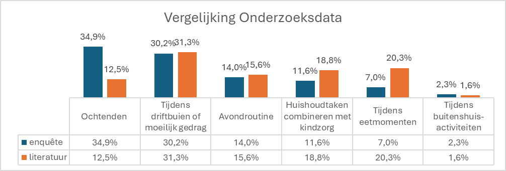

# Discovery

## Objectives

#### Main objective
The aim of this study was to identify the main causes of parenting stress among parents of children aged 2 to 5, with the ultimate goal of formulating a relevant and feasible starting concept for a physical-electronic product that helps reduce this stress.

#### Research question
Which factors cause the most parenting stress among parents of children aged 2 to 5, and how can these insights be translated into concrete design decisions?

#### Sub-objectives
- In which daily situations do parents experience the most parenting stress?
- Which stressors are consistently found in both literature and practice?
- Which of these stressors can be influenced through product design?
- In what context (time, location, interaction) should a supporting product function?

## Materials & Methods
The study was designed as a mixed-methods Discovery phase, consisting of three consecutive components: literature review, survey research, and a comparative analysis.

#### Literature Review
- Type of sources: peer-reviewed articles, theses, and one systematic review **(N = 8)**
- Selection via Google Scholar, Consensus.app, and Elsevier
- Inclusion criteria: parents of young children (ages 0–6), sufficient sample size, use of validated measurement instruments (PSI, NOSIK)

The identified stressors were extracted and clustered into recurring situations.

#### Survey Research
- Respondents: parents of children aged 2–5 **(N = 21)**
- Average parent age: 36 years
- Data collection: digital survey, anonymous and voluntary
- Respondents could indicate multiple stress situations
- Additional questions regarding usage context and preferences for a potential product

### Analysis Approach
- Frequency analysis per stress factor
- Analysis of co-occurring stress situations
- Comparison between literature and survey results
- Translation of insights into design requirements

> [!Note]
> The full approach to the tests and interviews can be found in the Design Protocol.
> [D1. Discovery_Protocol_Rootsaert_Selena](https://ugentbe.sharepoint.com/:w:/r/teams/Group.course1292872/_layouts/15/Doc2.aspx?action=edit&sourcedoc=%7Bced13246-a5b9-4a90-ba69-ba7b9f5bedb6%7D&wdOrigin=TEAMS-WEB.teamsSdk_ns.rwc&wdExp=TEAMS-TREATMENT&wdhostclicktime=1766311891243&web=1)

## Results

#### Literature review results
Six recurring stressful situations were identified and clustered:

- Tantrums or challenging behavior
- Mealtimes
- Combining household chores with childcare
- Evening routine
- Mornings (time pressure)
- Outdoor activities

Tantrums and behavioral problems were the most consistently found in the literature, followed by mealtimes and household demands.

#### Survey results
The survey showed that parents, in practice, experience stress most frequently during:
- Mornings (highest score)
- Tantrums or challenging behavior
- Evening routines and, to a lesser extent, household chores

In addition, approximately 80% of respondents indicated that a support product is preferred at home, during established routines.

Table 1. Stress factors overview matrix (Dutch)

|                       | Ochtenden | Avondroutine | Eetmomenten | Driftbuien | Huishoudtaken | Buitenshuis |
|-----------------------|-----------|--------------|-------------|------------|---------------|-------------|
| **Ochtenden**         | –         | 6            | 4           | 10         | 3             | 0           |
| **Avondroutine**      | 6         | –            | 2           | 4          | 1             | 0           |
| **Eetmomenten**       | 4         | 2            | –           | 3          | 1             | 0           |
| **Driftbuien**        | 10        | 4            | 3           | –          | 5             | 1           |
| **Huishoudtaken**     | 3         | 1            | 1           | 5          | –             | 1           |
| **Buitenshuis**       | 0         | 0            | 0           | 1          | 1             | –           |

### Comparative analysis
- Tantrums/difficult behavior: a high and consistent stressor in both datasets
- Mornings: significantly underestimated in the literature, but dominant in practice
- Mealtimes: more important in the literature than in practice
- Outdoor activities: marginal in both studies

This indicates a cumulative stress pattern around transitional moments (waking up, going to bed, behavioral escalations).

Table 2. Comparison Research Data (Dutch) 

> [!Note]
> The full details of the tests and results can be found in the Design Report.
> [D1. Discovery_Report_Rootsaert_Selena](https://ugentbe.sharepoint.com/:w:/r/teams/Group.course1292872/_layouts/15/Doc2.aspx?action=edit&sourcedoc=%7B07066592-c11e-4710-9cd2-73e4e3812c40%7D&wdOrigin=TEAMS-WEB.teamsSdk_ns.rwc&wdExp=TEAMS-TREATMENT&wdhostclicktime=1766312112114&web=1)

## Conclusions & Implications

#### Key conclusions

- The greatest parenting stress occurs during time-critical routines and emotional escalations in children.
- Products that support the child in self-regulation are more effective than products that instruct the parent.
- Stress reduction occurs when responsibility subtly shifts from parent to child, without blame or correction.

#### Design implications
Based on the results, the following design decisions were established:
- Focus on supporting the child, not on controlling the parent
- Can be used during morning and evening routines
- Hands-free or minimal interaction for the parent
- Calm, predictable feedback through light, sound, and behavior
- Permanent presence in the home environment

These implications led directly to the Wobble concept: an empathetic, interactive object that mirrors the child's behavior and emotions, thus encouraging self-regulation.

> [!IMPORTANT]
> An overview of the product requirements can be found under [Design Requirements](./design_requirements.md).
